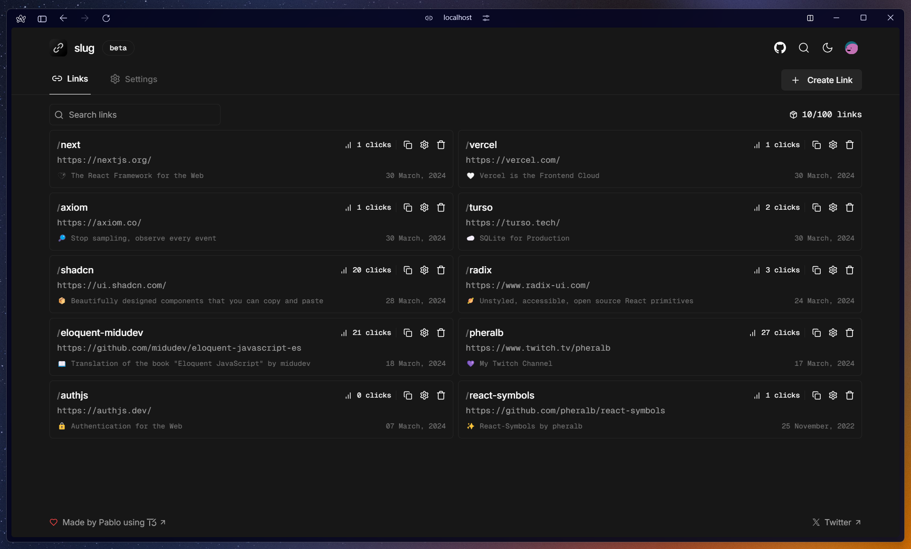

<div align="center">
  <a href="https://slug.vercel.app">
    
  </a>
  <p>
    <b>
      An open-source URL shortener built with T3 Stack.
    </b>
  </p>

<a href="https://slug.vercel.app/dashboard">Dashboard</a>
<span>&nbsp;&nbsp;❖&nbsp;&nbsp;</span>
<a href="#-roadmap">Roadmap</a>
<span>&nbsp;&nbsp;❖&nbsp;&nbsp;</span>
<a href="#-getting-started">Contribute</a>
<span>&nbsp;&nbsp;❖&nbsp;&nbsp;</span>
<a href="https://github.com/pheralb/slug/issues/new/choose">Create issue</a>
<span>&nbsp;&nbsp;❖&nbsp;&nbsp;</span>
<a href="https://twitter.com/pheralb_">X/Twitter</a>

<div align="center">
<a href="https://slug.vercel.app">

</a>
<p></p>
</div>


</div>

## 👨‍🚀 Introduction

[**Slug**](slug.vercel.app) is a service that offers to shorten urls in a simple, fast and secure way. It's built with [**T3 Stack**](https://create.t3.gg/), a web development stack made by [**Theo**](https://twitter.com/t3dotgg) focused on simplicity, modularity, and full-stack **typesafety**.

This project uses the following technologies:

- [**create-t3-app**](https://create.t3.gg) - The best way to start a full-stack, typesafe Next.js app.
- [**Next.js 14 App Router**](https://nextjs.org/) - The React Framework for the Web.
- [**Auth.js v5**](https://authjs.dev/) - Authentication for the Web.
- [**Prisma**](https://prisma.io) - A next-generation Node.js and TypeScript ORM.
- [**Turso**](https://turso.tech/) (SQLite) + [**libSQL**](https://github.com/tursodatabase/libsql) - SQLite for Production.
- [**Next.js Server Actions**](https://nextjs.org/docs/api-reference/server-actions) - Asynchronous functions that are executed on the server.
- [**TailwindCSS**](https://tailwindcss.com) + [**shadcn/ui**](https://ui.shadcn.com) & [**Radix Primitives**](https://www.radix-ui.com) - Design System.
- [**Prettier**](https://prettier.io) with [**prettier-plugin-tailwindcss**](https://github.com/tailwindlabs/prettier-plugin-tailwindcss) - Code Formatter.
- [**Lucide Icons**](https://lucide.dev) + [**svgl**](https://svgl.app) - Beautiful SVG icons & logos for the web.

> ⚠️ This is a community project, not associated with [Vercel](https://vercel.com/).

## 🚀 Getting Started

**Requirements:**

- [x] [Node.js](https://nodejs.org) (+v18.x) installed.
- [x] [pnpm](https://pnpm.io) (v8+) installed.
- [x] [Turso CLI](https://docs.turso.tech/cli/install) installed (for Windows users, it's necessary to [activate WSL 2](https://docs.microsoft.com/en-us/windows/wsl/install)).
- [x] [Visual Studio Code](https://code.visualstudio.com) with the recommended extensions installed (ESLint, Prettier, Tailwind CSS IntelliSense).

**Steps:**

1. Fork this project:

- [Click here](https://github.com/pheralb/slug/fork).

2. Clone the repository:

```bash
git clone git@github.com:YOU_USER/slug.git
```

3. Install dependencies:

```bash
# Install pnpm globally if you don't have it:
npm install -g pnpm

# and install dependencies:
pnpm install
```

4. Create a **.env** file with the following content:

> 🚧 The environment variables must match the following [schema](https://github.com/pheralb/slug/blob/main/src/env/schema.mjs#L8).

```bash
# Database:
DATABASE_URL= # "file:./dev.db"
TURSO_DATABASE_URL=
TURSO_AUTH_TOKEN=

# Auth.js =>
AUTH_SECRET=

# Github Provider =>
GITHUB_ID=
GITHUB_CLIENT_SECRET=

# Google Provider =>
GOOGLE_CLIENT_ID=
GOOGLE_CLIENT_SECRET=
```

**Database:**

- [**Create** a new database with Turso](https://docs.turso.tech/cli/db/create).
- [Get Turso **Auth Token**](https://docs.turso.tech/cli/auth/token).
- [Get Turso **Database URL**](https://docs.turso.tech/cli/db/show).

**Auth.js:**

- [Get Auth.js **Secret**](https://authjs.dev/getting-started/installation#setup-environment).
- ``AUTH_URL`` is the URL of your Auth.js API, for example, ``/api/auth``. You can change it in the [**``auth.ts`` file**](https://github.com/pheralb/slug/blob/next/src/auth.ts#L20).

**Github Credentials:**

- [Create a new OAuth App](https://docs.github.com/en/apps/oauth-apps/building-oauth-apps/creating-an-oauth-app).

**Google Credentials:**

- [Create a new OAuth 2.0 App from Google API Console](https://developers.google.com/identity/protocols/oauth2#1.-obtain-oauth-2.0-credentials-from-the-dynamic_data.setvar.console_name-.).

5. Generate a new migration file with Prisma:

```bash
pnpm db:migrate
```

6. Insert the migration data into the Turso database. To do this, go to ``package.json``, modify the ``db:push`` command with the name of the migration folder (2024***xxxxxxxxxx***_init) and run it in your terminal:

```bash
pnpm db:push
```

7. Run:

- Development server:

```bash
pnpm dev
```

and open [http://localhost:3000](http://localhost:3000) with your browser 🚀

- Prisma Studio:

```bash
pnpm db:studio
```

and  open [http://localhost:5555](http://localhost:5555) with your browser ✨

## 🔭 Roadmap

This is the roadmap I will be following for the complete migration to v3:

> - *✅* = Stable, completed.
> - *🔔* = Stable, but unexpected errors may appear.
> - *⚙️* = In progress.

⬆️ **Known issues:**

- ⚙️ Fix issue when logging in with different provider but with the same email. Redirect to an existing route in the app ([authjs error](https://authjs.dev/reference/core/errors#accountnotlinked)).

⬆️ **Dependencies:**

- ✅ Update `@prisma/adapter-libsql`, `@prisma/client` & `prisma` to the stable version when it's released.
- ⚙️ Update `authjs` to the stable version (v5) when it's released.

⬆️ **Auth:**

- ✅ Sign In with Github.
- 🔔 Sign In with Google.

🔔 Only for users who have not previously logged in with an existing email address in their Github account. This is an issue that will be worked on soon.

⬆️ **Middleware:**

- ✅ Redirect with `/*` and `/s/*`.
- ✅ Separate public, protected & authentication routes.

⬆️ **Dashboard (main):**

- ✅ Create a new short URL.
- ✅ List all shorted URLs.
- ✅ Delete a shorted URL.
- ✅ Update a shorted URL.`

⬆️ **Dashboard (tags):**

- ✅ Add search links by tags in the dashboard.
- 🔔 Create a new tag.
- ✅ Delete a tag.
- ⚙️ Update the tags of a link.

🔔 Add option to change tag color.

⬆️ **Dashboard (settings):**

- ✅ Change name.
- ✅ Change email.
- ✅ Delete account.
- ✅ Download all links data.

## ✌️ Contributing

<a href="https://github.com/pheralb/slug/graphs/contributors">
  
</a>

<p></p>

## ☁️ Deploy on Vercel

- ✅ [slug.vercel.app](https://slug.vercel.app/).

## 🔑 License

- [GPL-3.0 license](https://github.com/pheralb/slug/blob/main/LICENSE).
